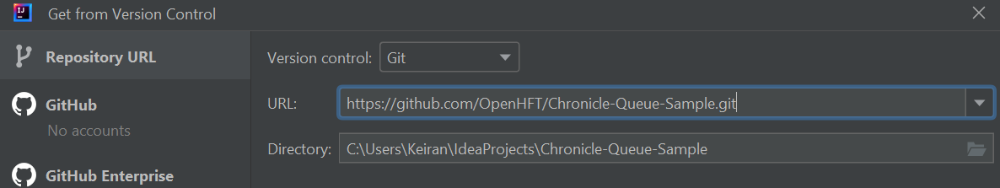
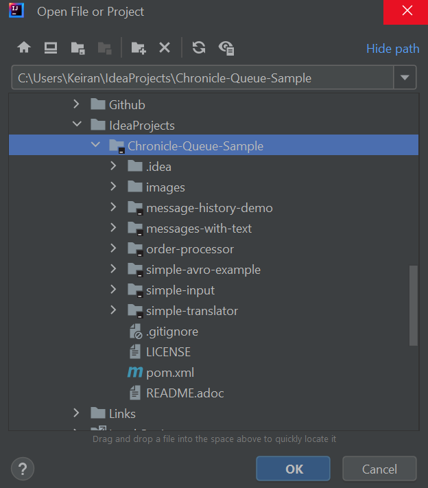

= Chronicle Queue Demo - README
:toc:
:toclevels: 3

This repository demonstrates the usage of Chronicle Queue (and related Chronicle libraries) through multiple examples, including an order processor, event routing, and more. Below is a quick start and pointers to further documentation.

== Quick Start

.Basic Steps
----
git clone https://github.com/OpenHFT/Chronicle-Queue-Demo.git
cd Chronicle-Queue-Demo
mvn clean install
----

To run a simple example, like the hello-world module:

----
cd hello-world
mvn install exec:java@RecordInputToConsoleMain
----

== Documentation

The project’s documentation is consolidated in five AsciiDoc files:

1. xref:architecture.adoc[Architecture]
2. xref:usage-and-tests.adoc[Usage & Tests]
3. xref:reference.adoc[Reference, Style & Glossary]
4. xref:account/README.adoc[Account Management System (AMS)]
5. xref:order-processor/README.adoc[Order Processor]

Refer to them for details on architecture, usage instructions, testing approaches, style guides, and advanced references.

== Repository Overview

The modules in this repository include:

* **account**: An Account Management System (AMS) example using Chronicle Queue event-driven logic.
* **benchmarks**: Scripts and classes demonstrating throughput/latency benchmarks (e.g., LatencyDistributionMain, ThroughputMain).
* **event-routing**: Showcases how messages can be routed via Chronicle Queues with interfaces like `ViaIn`, `ViaOut`.
* **hello-world**: A simple introduction to an event-driven microservice using Chronicle Queue (input, exclamation addition, output).
* **md-pipeline**: A Market Data pipeline example with aggregator, strategy, and an exchange simulator.
* **message-history-demo**: Demonstrates Chronicle’s `MessageHistory` in bridging or event processing scenarios.
* **messages-with-text**: An example of writing/reading textual content with minimal garbage creation.
* **order-processor**: A submodule that acts as a simple OMS (Order Management System), referencing FIX 4.2 concepts.

For deeper details on each, see xref:architecture.adoc[Architecture].

== Order Processor

This is a tutorial demonstrating the usage of Chronicle Queue with simple demo programs.

You can find the source code for the order processor example https://github.com/OpenHFT/Chronicle-Queue-Demo/tree/master/order-processor[here].

== Downloading and Running Sample Programs

If you're running Windows, you will need to install the `git` client and `open-ssh` Cygwin, https://cygwin.com/install.html[here], with a guide showing installation and packages http://www.mcclean-cooper.com/valentino/cygwin_install/[here].
This allows you to install Linux packages that aren't already on Windows.

When this asks you which packages you want to install, search for and add `git`.
This is under `Development` and you need to click `skip` so it says to `install`.

image::images/gitpack.png[]

Open IntelliJ or your favorite https://en.wikipedia.org/wiki/Integrated_development_environment[Integrated Development Environment (IDE)]. If you haven't installed an IDE, we recommend https://www.jetbrains.com/idea/download/#section=windows[IntelliJ], which we'll use for this tutorial.

In IntelliJ, select `Get from VCS` to clone the Chronicle Queue Sample code.

image::images/homegit.png[]

Then, copy the following URL into the `Git Repository URL` field and remember the `Parent Directory`. Click `Clone` to get the code.

[source]
----
https://github.com/OpenHFT/Chronicle-Queue-Demo.git
----

If you close the project, you can reopen it by going to `File -> Open`. You'll find the repository in the directory where you saved it.

Now you're ready to run the example programs! You can start with https://github.com/OpenHFT/Chronicle-Queue-Demo/tree/master/simple-input[Simple Input].

The second example is https://github.com/OpenHFT/Chronicle-Queue-Demo/tree/master/simple-translator[Simple Translator].
