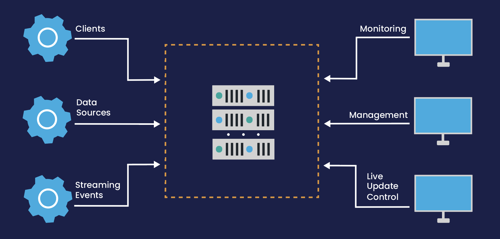

= Low-Latency Account Management System Over TCP and Shared Memory
Peter Lawrey

This example shows a simple high performance microservice accessible via TCP or shared memory storing each message in and out persisted in a Chronicle Queue.
There are a number of configurations with a comparison of the performance.
It is designed to produce minimal garbage to minimise jitter.

This Account Management System is designed to handle basic account operations such as account creation and fund transfers.
It's built on Chronicle Wire and uses Fluent Interface pattern, taking advantage of YAML files for test input data.

This system leverages the `channels` package in Chronicle Wire, a high-speed messaging framework that excels in handling high volume and latency-critical data.

== Overview

The Account Management System serves as an efficient banking system that facilitates basic account operations, including account creation and fund transfers.
It is architected for low latency, efficient memory utilization, and performance under high transaction volume scenarios.

The core functionality is built around three main components:

. *Account Creation*: This feature allows for the establishment of new bank accounts with relevant details, such as account holder's name, account ID, currency type, and the initial balance.
. *Fund Transfer*: The system is capable of processing funds transfer between different accounts securely and swiftly.
Transfer details include sender account, target account, transfer amount, currency type, and a reference note.
. *Checkpointing*: The checkpoint functionality provides a snapshot of the current state of all accounts in the system at a specific point in time.

== Network Communication

The system communicates over TCP to ensure reliable data transmission, or shared memory where possible to minimise latencies.
TCP is chosen for its built-in error checking and correction, ensuring that all account management data reaches the correct destination in the correct order and without errors.
All shared memory messaging is persisted to memory mapped files as it is written.

There is a commercial extension https://chronicle.software/services/ that supports

- Control over restarting of services
- Idempotent collections to simplify restarting event processing.
- Acknowledged Replication for High Availability and Realtime Distribution restartable across hosts.
- Encryption of messages stored on disk.
- Monitoring and Management support

== Testability and Benchmarking

The system also comes with a comprehensive set of tests and a benchmarking suite, allowing for easy performance measurement and regression testing.
The `AccountManagerBenchmarkMain` class acts as a benchmarking and testing entry point, demonstrating the functionality of the system and showing the execution time for the operations.

== Network Layouts

The client and the service can be laid out in a variety of ways without changing the code

=== TCP Client, TCP Service

This approach offers the most distributed option.
The typical latencies are under 20 &micro;s with the 99%ile latency not much higher.

[source,mermaid]
....
sequenceDiagram
autonumber
Client->>Gateway: transfer
Note over Client,Gateway: via TCP, persisted
Gateway->>+Service: transfer
Note right of Gateway: via TCP
Note right of Service: processes event
Service->>-Gateway: onTransfer
Note over Service,Gateway: via TCP, persisted
Gateway->>Client: onTransfer
Note left of Gateway: via TCP
....

This can be benchmarked all in one with the command line properties `-Durl=tcp://localhost:1248 -DserviceUrl=tcp://:1248` running `AccountManagerBenchmarkMain`

=== TCP Client, Shared Memory Service

This approach offers the most distributed option. The typical latencies are around 10 &micro;s with the 99%ile latency not much higher.

[source,mermaid]
....
sequenceDiagram
autonumber
Client->>Gateway: transfer
Note over Client,Gateway: via TCP, persisted
Gateway->>+Service: transfer
Note right of Gateway: via Shared Memory
Note right of Service: processes event
Service->>-Gateway: onTransfer
Note over Service,Gateway: via Shared Memory, persisted
Gateway->>Client: onTransfer
Note left of Gateway: via TCP
....

This can be benchmarked all in one with the command line properties `-Durl=tcp://:1248` running `AccountManagerBenchmarkMain`

=== Shared Memory Client and Service

This approach offers the most distributed option. The typical latencies are under 2 &micro;s with the 99%ile latency about double this.

[source,mermaid]
....
sequenceDiagram
autonumber
Client->>queue: transfer
Note over Client,queue: via Shared Memory, persisted
queue->>+Service: transfer
Note right of queue: via Shared Memory
Note right of Service: processes event
Service->>-queue: onTransfer
Note over Service,queue: via Shared Memory, persisted
queue->>Client: onTransfer
Note left of queue: via Shared Memory
....

This can be benchmarked all in one with the default command line properties running `AccountManagerBenchmarkMain`

== Package Structure

We lay out our packages in the following manner

- `api` package for the input and output interfaces.
The input of one microservice might be the output of another microservice.
- `dto` package for POJOs (Plain Old Java Objects) that hold the data associated with each event.
- `impl` package for the service implementation and the high level classes it uses
- `util` package for separating low level helper methods and classes.

For demos, we might include `main` classes, however for a production system, we use a framework Chronicle Services https://chronicle.software/services/ to handle manageability, monitoring, restart and fail over.

== How to Run

. Compile the source files using your preferred Java compiler.
. `AccountManagerServiceMain` runs the end service responsible for holding state and generating results of transactions

. `AccountManagerGatewayMain` acts as a gateway listening for TCP connections and writing to/reading from the shared memory queue the microservices uses

. `AccountManagerClientMain` injects a few simple messages and waits for resulting events from the AccountManagerImpl

`AccountManagerBenchmarkMain` runs a `JLBH` benchmark to report on the latency distribution running on your machine.

== Prerequisites

You need Java 8 or above installed on your machine to run this system.

== Input Data Format

Input data is given in YAML format.
Here's an example of an account creation:

[source,yaml]
----
# Creating an account for Alice with 1000 EUR
createAccount: {
  sender: gw1,
  target: vault,
  sendingTime: 2023-01-20T10:00:00,
  name: alice,
  account: 101013,
  currency: EUR,
  balance: 1000
}
----

And an example of a transfer:

[source,yaml]
----
# Alice sends 10 EUR to Bob
transfer: {
  sender: gw2,
  target: vault,
  sendingTime: 2023-01-20T10:03:00,
  from: 101013,
  to: 101025,
  currency: EUR,
  amount: 10,
  reference: Dog food
}
----

== Note

This is a basic implementation and does not handle many edge cases.
It also lacks a user-friendly interface, and the input is provided directly through YAML files.
It's intended as a demonstration of a system built on Chronicle Wire, and may not be suitable for production use without further modifications and improvements.

== Contribute

We would love your contributions!
Please submit a pull request with any improvements or bug fixes you have made.
