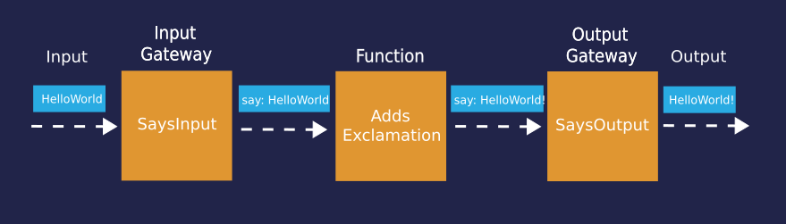
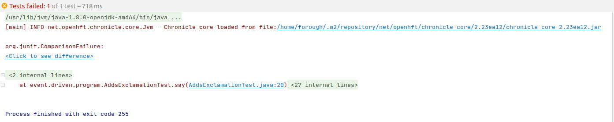
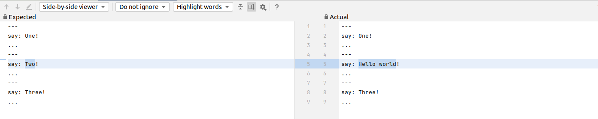

= Event Driven Program Demo

This demo steps through event driven program development, testing and writing a simple microservice which operates a simple function on input events. In this demo event driven systems have been modeled so that, the event driven core systems has input and output gateways connecting to external systems that might not be event driven and the business logic is placed in the core event driven system. Figure 1 shows a general sketch of the introduced model with a simple business logic that adds exclamation mark to input messages (events) and then sends them to the output gateway.

.An event driven system based on the introduced model, the system adds exclamation mark to input messages and sends them to output

== Implementation

In the following sections several event driven systems with the general structured shown in Figure 1 are implemented. All the implementations use the same input and output gateways.

=== Input and Output Gateways

The input and output gateways used in this demo are implementations of the functional interface link:../hello-world/src/main/java/event/driven/program/api/Says.java[Says]. The input gateway reads each input line and calls say(input line) method.

.Input gateway
[source,java]
----
public class SaysInput {
    public static void input(Says says) throws IOException {
        BufferedReader br = new BufferedReader(new InputStreamReader(System.in));
        for (String line; ((line = br.readLine()) != null); )
            says.say(line);
    }
}
----
The output gateway prints out the received messages.

.Output gateway
[source,java]
----
public class SaysOutput implements Says {
    public void say(String words) {
        System.out.println(words);
    }
}
----

In the following section several event driven examples are implemented using the above gateways.

=== Relaying Input Events to Output

This system simply relays input events to output thus it can be implemented easily as the output of one gateway is wired to the input of the other. This is implemented in `RecordInputToConsoleMain` class.

.RecordInputToConsoleMain
[source,java]
----
public class RecordInputToConsoleMain {
    public static void main(String[] args) throws IOException {
        // Writes text in each call to say(line) to the console
        final Says says = new SaysOutput();
        // Takes each line input and calls say(line) each time
        SaysInput.input(says);
    }
}
----

By running `RecordInputToConsoleMain` (right click on the class and select Run), each line of input will be echoed on the console:

[source,text]
----
One              // input event
One              // output event
Two              // input event
Two              // output event
Three            // input event
Three            // output event
----

=== Log Input Events in Yaml Format

`RecordInputAsYamlMain` implements an event driven system so that input messages are logged as Yaml on the console. `Wires.recordAsYaml` creates and returns a proxy of `Says` interface which writes inputs into the specified PrintStream in Yaml format.
//TODO add link to Wires.recordAsYaml when it approved and merged

.RecordInputAsYamlMain
[source,java]
----
public class RecordInputAsYamlMain {
    public static void main(String[] args) throws IOException {
        // obtains a proxy that writes to the PrintStream the method calls and their arguments
        final Says says = Wires.recordAsYaml(Says.class, System.out);
        // Takes each line input and calls say(theLine) each time
        SaysInput.input(says);
    }
}
----

To run `RecordInputAsYamlMain` right click on `RecordInputAsYamlMain` and select "Modify Run Configuration ...". In the pop-up window in the "program arguments" field write the input file name (ie says.yaml) then click on OK and run the program, the following can be observed on console.

[source,text]
----
One                    // input event
say: One               // output event
...
Two                    // input event
say: Two               // output event
...
Three                  // input event
say: Three             // output event
...
----

=== Replaying Logged Outputs from a Yaml File

For this example the outputs from the above section has benn logged into resources/says.yaml file. The file is read and replayed to `SaysOutput` by Wire.replay method.
//TODO add link to the method.

.ReplayOutputMain
[source, java]
----
public class ReplayOutputMain {
    public static void main(String[] args) throws IOException {
     // Reads the content of a Yaml file specified in args[0] and feeds it to SaysOutput.
      Wires.replay(args[0], new SaysOutput());
    }
}
----

By running `ReplayOutputMain` the following output will be printed out on the console.

[source, java]
----
One
Two
Three
----

[source,java]
----
public class DirectWithExclamationMain {
    public static void main(String[] args) throws IOException {
        // Adds exclamation mark to input messages
        SaysInput.input(new AddsExclamation(new SaysOutput()));
    }
}
----
=== Adding a Microservice

Now the intermediate block in Figure 1 is implemented using a microservice that appends an exclamation mark to input messages and pass it to the output gateway.

.AddsExclamation microservice
[source,java]
----
public class AddsExclamation implements Says {
    private final Says out;

    public AddsExclamation(Says out) {
        this.out = out;
    }

    public void say(String words) {
        this.out.say(words + "!");
    }
}
----

`DirectWithExclamationMain` integrates the three components (Input/Output gateway and `AddsExclalation`) in Figure 1. By running `DirectWithExclamationMain`, an exclamation mark is appended to each input and then will be printed out on the console.

[source,text]
----
One              // input event
One!             // output event
Two              // input event
Two!             // output event
Three            // input event
Three!           // output event
----

=== Testing the Microservice

To test the microservice, link:https://github.com/OpenHFT/Chronicle-Wire/blob/ea/src/main/java/net/openhft/chronicle/wire/TextMethodTester.java[TextMethodTester] is used that can read input (resources/in.yaml) and expected output (resources/out.yaml) files of the microservice and compares it to the actual output.

.Testing the microservice
[source,java]
----
public class AddsExclamationTest {
    @Test
    public void say() throws IOException {
        TextMethodTester<Says> tester = new TextMethodTester<>(
                "says/in.yaml",
                AddsExclamation::new,
                Says.class,
                "says/out.yaml");
        tester.run();
        assertEquals(tester.expected(), tester.actual());
    }
}
----
Running the test should log "Process finished with exit code 0" on the console which shows the test has passed.
Change the second input in in.yaml to Hello World and run the test again, to see the test fails.

.Test result (fail)

By clicking on the <click to see difference> link, you will see the difference between expected and actual outputs.

.Difference between expected and actual test result

== Running the Demo from Maven
Open a shell and from the example directory, hello-world, run the following. commands.

.Building the code
[source,sh]
mvn clean install

.Run RecordInputToConsoleMain
[source,sh]
mvn install exec:java@RecordInputToConsoleMain

.Run RecordInputAsYamlMain
[source,sh]
mvn install exec:java@RecordInputAsYamlMain -Dexec="says.yaml"

.Run ReplayOutputMain
[source,sh]
mvn install exec:java@ReplayOutputMain

.Run DirectWithExclamationMark
[source,sh]
mvn install exec:java@DirectWithExclamationMark

